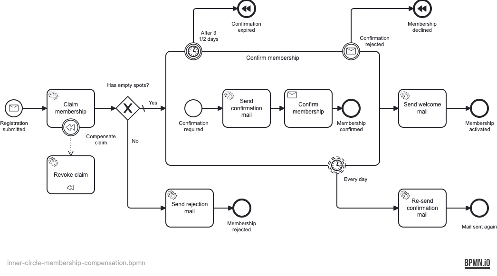
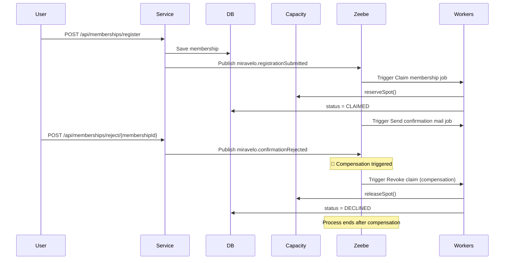

# ⏪ Saga Pattern with BPMN Compensation

This example demonstrates how to handle **distributed transaction rollbacks** using the saga pattern with BPMN
compensation events. When a later step in a process fails or is cancelled, compensation handlers reliably undo
previously completed operations to keep the system consistent.

By leveraging Zeebe's built-in compensation mechanism, the rollback logic is declared directly in the BPMN model,
so the engine orchestrates it whenever the process takes a path that requires undoing earlier work.

## **Overview** 🛠️

The saga pattern addresses the challenge of maintaining consistency across multiple operations when traditional ACID
transactions aren't possible. Instead of rolling back a single database transaction, sagas use compensating actions to
undo the effects of previously completed steps.

**Core Concept:**

1. Execute forward operations (claim a spot → wait for confirmation → activate)
2. If a later step fails or is abandoned, trigger compensation for the completed steps
3. Compensation handlers undo the effects

This example uses the Inner Circle membership flow: a registration claims one of the limited spots. If the member
never confirms (the confirmation expires) or actively declines, the claim is revoked and the spot is released again.

**Contrast with the other modules:** the other pattern examples "forget" this rollback. There, a membership whose
confirmation expired or was rejected keeps its spot forever, and the Inner Circle slowly fills up with declined
members.

## **Process Flow** 📊

The `inner-circle-membership-compensation.bpmn` model implements the following flow:



```
1. Registration submitted (message miravelo.registrationSubmitted) → Start Process
2. Claim membership (compensatable, reserves a spot in memory)
3. Gateway: Has empty spots?
   ├─ No  → Send rejection mail → End (Membership rejected)
   └─ Yes → Confirm membership subprocess
            ├─ Send confirmation mail, wait for miravelo.membershipConfirmed
            ├─ Resend confirmation mail every day
            ├─ Confirmation deadline reached → Compensate → Revoke claim → End (Confirmation expired)
            └─ miravelo.confirmationRejected → Compensate → Revoke claim → End (Membership declined)
4. Confirmed → Send welcome mail → End (Membership activated)
```

**Key BPMN Elements:**

- **Compensatable Activity**: `Claim membership` carries a boundary compensation event
- **Compensation Handler**: `Revoke claim` service task with `isForCompensation="true"` (job `membership.revokeClaim`)
- **Compensation Triggers**: The end events `Confirmation expired` and `Membership declined` throw compensation for
  `Claim membership`

## **Implementation** 💻

**Spot Management (Limited Resource):**

- [InMemoryMembershipCapacity](src/main/kotlin/io/miragon/example/adapter/out/memory/InMemoryMembershipCapacity.kt):
  In-memory counter of the available Inner Circle spots. `reserveSpot()` takes one, `releaseSpot()` gives it back.

**Key Services:**

1. [RegisterMembershipService](src/main/kotlin/io/miragon/example/application/service/RegisterMembershipService.kt):
   Persists the membership and publishes `miravelo.registrationSubmitted` to start the process
2. [ClaimMembershipService](src/main/kotlin/io/miragon/example/application/service/ClaimMembershipService.kt):
   Reserves a spot (compensatable operation) and marks the membership as claimed or rejected
3. [RevokeClaimService](src/main/kotlin/io/miragon/example/application/service/RevokeClaimService.kt):
   Compensation handler that releases the spot and marks the membership as declined
4. [ConfirmMembershipService](src/main/kotlin/io/miragon/example/application/service/ConfirmMembershipService.kt) /
   [RejectConfirmationService](src/main/kotlin/io/miragon/example/application/service/RejectConfirmationService.kt):
   Publish `miravelo.membershipConfirmed` or `miravelo.confirmationRejected` correlated by `membershipId`

**Zeebe Job Workers:**

- **[ClaimMembershipWorker](src/main/kotlin/io/miragon/example/adapter/in/zeebe/ClaimMembershipWorker.kt)**:
  `membership.claimMembership`, returns `hasEmptySpots`
- **[RevokeClaimWorker](src/main/kotlin/io/miragon/example/adapter/in/zeebe/RevokeClaimWorker.kt)**:
  `membership.revokeClaim`, triggered automatically by Zeebe as compensation
- **[SendConfirmationMailWorker](src/main/kotlin/io/miragon/example/adapter/in/zeebe/SendConfirmationMailWorker.kt)**,
  **[SendRejectionMailWorker](src/main/kotlin/io/miragon/example/adapter/in/zeebe/SendRejectionMailWorker.kt)**,
  **[SendWelcomeMailWorker](src/main/kotlin/io/miragon/example/adapter/in/zeebe/SendWelcomeMailWorker.kt)**:
  the remaining `membership.*` job types

**REST API (port 8083):**

- `POST /api/memberships/register` with `{ "email": "...", "name": "..." }` → `{ "membershipId": "..." }`
- `POST /api/memberships/confirm/{membershipId}`
- `POST /api/memberships/reject/{membershipId}`

**Process Adapter:**

- [MembershipProcessAdapter](src/main/kotlin/io/miragon/example/adapter/out/zeebe/MembershipProcessAdapter.kt):
  Publishes the `miravelo.*` messages directly to Zeebe

## **Sequence Flow** 📊

If the member declines, the following sequence of events occurs:



The same compensation runs when the confirmation deadline timer fires instead of the rejection message.

**Spot Lifecycle:**

- Spot reserved → Member confirms → Welcome mail sent, spot stays taken (happy path)
- Spot reserved → Confirmation expires or is rejected → Compensation releases the spot (compensation path)

## **Advantages** 🎉

- **Declarative Rollback Logic**: Compensation structure defined in BPMN, not scattered in code
- **Automatic Execution**: Zeebe orchestrates compensation automatically when triggered
- **Business Visibility**: Compensation flows are visible in Operate, aiding debugging
- **Decoupled Rollback**: Compensation handlers are separate from forward logic
- **Guaranteed Execution**: Compensation handlers retry automatically if they fail
- **Partial Rollback**: Can compensate specific activities, not all-or-nothing

## **Downsides** ⚠️

- **Eventual Consistency**: Compensation happens asynchronously, temporary inconsistency exists
- **Complexity**: More complex than simple database rollbacks
- **Idempotency Required**: Compensation handlers must be idempotent (may execute multiple times)
- **Semantic Undo**: Not all operations can be undone semantically (e.g., sent emails)
- **Testing Overhead**: Need to test both happy path and compensation paths
- **BPMN Expertise**: Requires understanding of BPMN compensation semantics

## **When to Use This Pattern?**

**Use saga pattern when:**

- Transactions span multiple microservices or external systems
- Traditional distributed transactions (2PC) are not feasible
- Long-running business processes need rollback capability
- Operations can be semantically undone (e.g., release a spot, cancel a booking)
- You need visibility into rollback operations for business stakeholders

**Don't use saga pattern when:**

- Operations cannot be semantically compensated (e.g., physical shipments)
- Eventual consistency is unacceptable for your use case
- You need immediate, synchronous rollbacks

## **Complementary Patterns**

| Pattern Combination          | What It Solves                                                              |
|------------------------------|-----------------------------------------------------------------------------|
| **Saga only**                | ✅ Distributed rollbacks, ⚠️ No transaction safety during forward operations |
| **Saga + After-Transaction** | ✅ Rollbacks + ✅ Transaction coordination                                    |
| **Saga + Outbox**            | ✅ Rollbacks + ✅ Reliable message delivery                                   |
| **Saga + Idempotency**       | ✅ Rollbacks + ✅ Prevents duplicate compensation executions                  |

**Recommended**: Combine saga pattern with transaction coordination (After-Transaction or Outbox) and idempotency for
production systems.

## **Testing the Example**

1. **Start infrastructure**: `cd stack && docker-compose up`
2. **Run the application**: Execute `ExampleApplication.kt` (port 8083)
3. **Register**: `POST /api/memberships/register` and note the `membershipId`
4. **Monitor in Operate**: Visit http://localhost:8080/operate (demo/demo)
5. **Observe outcomes**:
    - **Confirm** via `POST /api/memberships/confirm/{membershipId}`: process completes, spot stays taken
    - **Reject** via `POST /api/memberships/reject/{membershipId}` or wait for the deadline: compensation runs,
      the log shows the released spot and the membership is `DECLINED`

Or run the automated scenario: `cd bruno && npx --yes @usebruno/cli@4.0.0 run . --env saga --tags saga -r`.

> ⚠️ This process and the one of the other examples start on the same message. If a pattern example was deployed to the
> same stack before, a registration starts both processes. Reset the stack with `docker-compose down -v` first.

## **Conclusion**

The saga pattern with BPMN compensation provides a powerful mechanism for handling distributed rollbacks in
process-driven architectures. By declaring compensation logic in your BPMN model, Zeebe can automatically orchestrate
rollbacks when a process is abandoned, ensuring consistency across your distributed system.
